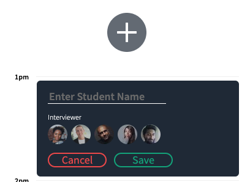

# Interview Scheduler

## Setup

Install dependencies with `npm install`.

## Running Webpack Development Server

```sh
npm start
```

## Running Jest Test Framework

```sh
npm test
```

## Running Storybook Visual Testbed

```sh
npm run storybook
```
&nbsp;
# Screen Shots




&nbsp;

# Deployment

Server deployed to Heroku
* scheduler API at https://scheduler-zxw.herokuapp.com/api/

Production deployed to Netlity
* scheduler App at https://scheduler-zxw.netlify.app

&nbsp;
# Stretch Work

- Using Reducers to dipatch centain actions

- Building up Websockets to update states while there are concurrent users

- Integration Test for an appointment updating by mocking websocket response

- Deploying the api and App to Heroku, CircleCI and Netlify

